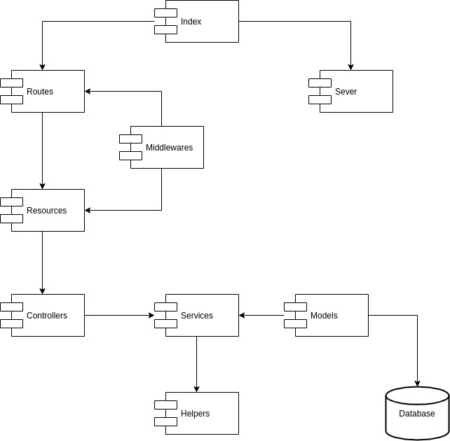

# Dacode API challenge

# Logic test

Run the `index.js` inside the logic-test folder:
```
$ node logic-test/index.js
```
And follow the command line instructions.

# API
## Installation
### Pre requisites
- Node > 8.0.X
- Mysql
- NPM > 6.0.X

**Create the database**

Run the `setup.sql` file.

**Install the dependencies**
```
$ npm install
```
**Fill the env file**

Rename the .env.example file to .env and file the connection credentials
```
DATABASE_HOSTNAME = 
DATABASE_PORT     = 3306
DATABASE_USERNAME = 
DATABASE_PASSWORD = 
DATABASE_SCHEMA   = 'courses_app'

SECRET_TOKEN = 'yoursecretkey'
EXPIRATION_TOKEN = '8h'
NODE_ENV = 'development'
```
**Run the server**
```
$ npm run server
```
## Libraries used
**Core dependencies:**

- **bcrypt:** Used for hash and compare passwords, I chose it because for the community support and the frequent updates.
- **express:** Used for create a http server and routing handling. I  preferred because it adds dead simple routing and support for Connect middleware, allowing many extensions and useful features.
- **objection:** Used as ORM for database handling; depends on *knex* and *mysql* package. I chose it because aims to stay out of your way and make it as easy as possible to use the full power of SQL and the underlying database engine, also  is built on the wonderful SQL query builder knex. All databases supported by knex are supported by objection.js. SQLite3, Postgres and MySQL are thoroughly tested.
- **cors:** Used to enable the communication between the different clients. I preferred because it's very easy to config and works perfect with Express.
- **dotenv:** Used to load environment variables. I chose it because the configuration it's very easy, also for the frequent updates.
- **eslint:** Used for code style guide. I preferred the *google's* configuration because I've been working with that almost over 2 years.
- **jsonwebtoken:** Used for authentication. I chose it for the stateless advantage, also for the payload's feature and because can expire.
- **compression:** Used for compress the request between server-client. I chose it just for convention and because works perfectly with express.
- **body-parser:** Used for parse incoming request bodies in a middleware before handle it. I chose it because without this package it's very difficult handle the requests. 
- **helmet:** Used for secure the Express app by setting various HTTP headers. I chose it just for convention and because works perfectly with express.
- **morgan:** Used request logging. I used it mostly for debugging and develop purposes and because for production can provide useful information.

## Architecture description
Based on the Principle of Unique Responsibility, the REST API's architecture is service oriented and is divided into six layers: model, controller, resource, service, routes, middleware and helpers where each layer has a specific and single purpose described below.

- **Model:** In this layer the Models are incorporated, which define the attributes that make up our objects.
- **Controller:** This layer is an abstraction of the business logic, encapsulating one or more services and defining the resource representation.
- **Resource:** The endpoints of our application that will be used by the clients that require the service are defined. This layer have the responsibility to delimit the *Express* objects, making accessible the controller's methods by a generic objects.
- **Service:** The responsibility of this layer is to implement the business logic that is necessary, manipulating the data coming from the model layer.
- **Middleware:** This layer have the responsibility to handle the incoming request, answer to the client if its necessary or pre process data to provide to another middleware or the resource.
- **Helpers:** This layer has the responsibility it's provide common modules, methods or functions to the different services. 

### API architecture diagram

## Usage

The table below contains the possibles *HTTP Status Codes* for error responses.

### Error object
```JSON
{
    "status": "error",
    "data": {
        "httpStatus": <status number>,
        "message": "<error message>"
    }
}
```
### Error codes

| HTTP Code | Reason |
|------------| ---------|
| 500 | Internal server error. |
| 422 |   The request isn't complete or the format is incorrect. |
| 405 | Incorrect permissions.|
| 404 | Resource not found. |
| 401 | Corrupted or expired token. |
| 400 | Malformed JSON. |
| 409 | Database duplicity. |

### API documentation

See the documentation [here](https://documenter.getpostman.com/view/4779053/SzKYNw2m?version=latest#29fc6734-563a-498d-90fe-7642a835a2dc).